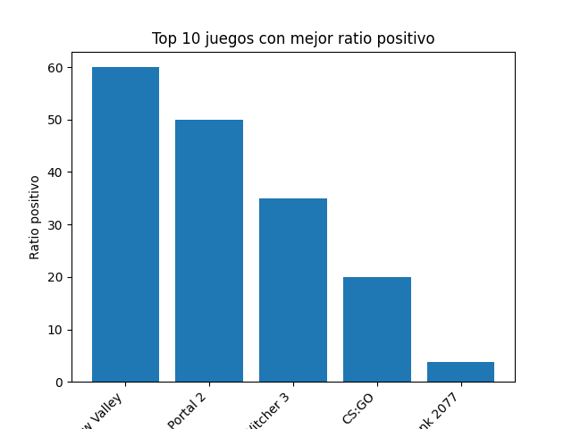

# 🎮 Análisis de Juegos de Steam 📊

Este proyecto consiste en un análisis básico de un dataset de ventas y reseñas de videojuegos de Steam. El objetivo principal es identificar los juegos mejor valorados mediante un cálculo de ratio de reseñas positivas.

 *Top 10 juegos por ratio positivo*

## 📂 Archivos

- `analisis_juegos.ipynb` - Notebook interactivo con el código y análisis paso a paso
- `steam_games_simple.csv` - Dataset con información de juegos y sus reseñas
- `top10_juegos_ratio.png` - Gráfico resultante del análisis

## 🛠 Tecnologías usadas

  
  
  

## 🚀 Cómo usar

1. Clona el repositorio
2. Abre el notebook `analisis_juegos.ipynb` con:
   - Jupyter Notebook
   - JupyterLab
   - VS Code con extensión Jupyter
3. Ejecuta las celdas en orden para reproducir el análisis

---