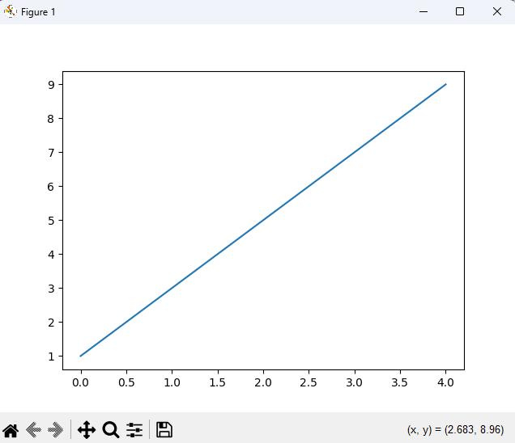
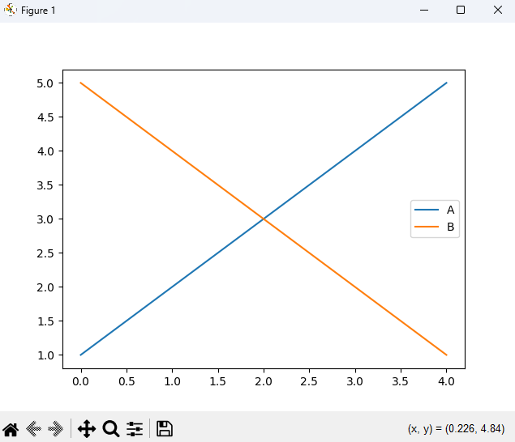
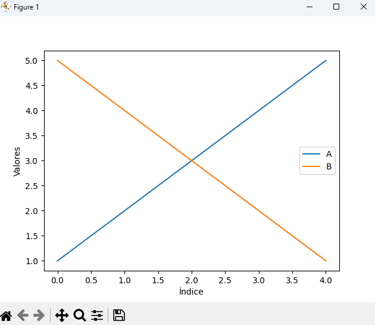

## 📊 Visualización básica con pandas
**Pandas ofrece una forma sencilla de generar gráficos utilizando el método .plot() en Series y DataFrames. Este método es un envoltorio alrededor de matplotlib.pyplot, lo que facilita la creación de gráficos sin necesidad de escribir mucho código.**

## Ejemplo básico:

```python
import pandas as pd
import matplotlib.pyplot as plt


ts = pd.Series([1, 3, 5, 7, 9])

ts.plot()
plt.show()

```
 

## Gráficos con DataFrame:

```python

df = pd.DataFrame({
    'A': [1, 2, 3, 4, 5],
    'B': [5, 4, 3, 2, 1]
})

df.plot()
plt.show()

```

 

## 📈 Tipos de gráficos disponibles

**Se puede especificar el tipo de gráfico utilizando el parámetro kind:**

- ``'line'``: gráfico de líneas (predeterminado).
- ``'bar'``: gráfico de barras verticales.
- ``'barh'``: gráfico de barras horizontales.
- ``'hist'``: histograma.
- ``'box'``: diagrama de caja.
- ``'kde'`` o ``'density'``: gráfico de densidad.
- ``'area'``: gráfico de área.
- ``'pie'``: gráfico circular.
- ``'scatter'``: gráfico de dispersión (solo para DataFrame).


## 🎨 Personalización de gráficos

**Pandas permite personalizar los gráficos utilizando matplotlib. Por ejemplo, para agregar etiquetas a los ejes:**


```python

ax = df.plot()
ax.set_xlabel("Índice")
ax.set_ylabel("Valores")
plt.show()
```

 

## 📥 Guardar gráficos

**Para guardar gráficos en archivos utilizamos savefig de matplotlib:**

```python
fig = df.plot()
fig.get_figure().savefig('grafico.png')
```